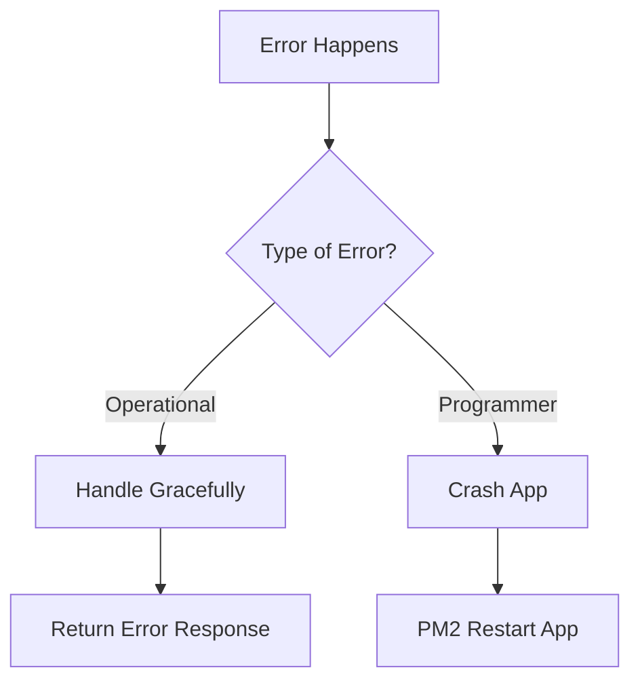

## 5. package.json and package-lock.json — Advanced control

- **package.json**:

  - Can define **scripts**, **dependencies**, **engines** (specify Node.js version).
  - Custom fields can be added too (`"author"`, `"repository"`, `"license"`, etc).

- **package-lock.json**:
  - Ensures **deterministic installs** — no surprises when teammates install your app.
  - Records **exact versions** and **dependency tree**.

**Example:**

```json
"dependencies": {
  "express": "^4.18.2"
},
"lockfileVersion": 2,
"packages": {
  "": {},
  "node_modules/express": {
    "version": "4.18.2"
  }
}
```

## 6. Publishing Your Own npm Package

Steps:

1. Create your code (e.g., a library).
2. `npm init` to generate package.json
3. Add a unique name.
4. `npm login` (create an npmjs.com account if needed).
5. `npm publish`

> Pro Tip:  
> If name already exists, npm will throw an error. Use `@scope/package-name` for personal namespacing.

Example:

```bash
npm publish --access public
```

### 1. Event Loop Race

**Challenge**:  
Predict the exact output order of this code:

```javascript
console.log("Start");

setTimeout(() => {
  console.log("Timeout 1");
}, 0);

Promise.resolve().then(() => {
  console.log("Promise 1");
});

setImmediate(() => {
  console.log("Immediate 1");
});

process.nextTick(() => {
  console.log("Next Tick 1");
});

console.log("End");
```

▶️ **Task**:  
Write down the output order **before** you run it. Explain _why_ it's that order based on Event Loop phases.

### 2. Heavy CPU Blocking Simulation

**Challenge**:  
Simulate heavy CPU blocking in Node.js and show how it blocks the event loop.

Example hint:

```javascript
const start = Date.now();
while (Date.now() - start < 5000) {
  // Block for 5 seconds
}
console.log("Done!");
```

▶️ **Task**:  
Now try putting `setTimeout(() => console.log('Hello'), 1000);` **before** the loop.

Explain why it **doesn't** print "Hello" after 1 second.

### 3. Create your own Event Loop simulation (Tiny Version)

**Challenge**:  
Fake a mini event loop using JavaScript arrays.

Example:

```javascript
const microTasks = [];
const macroTasks = [];

function eventLoop() {
  while (microTasks.length || macroTasks.length) {
    while (microTasks.length) {
      const task = microTasks.shift();
      task();
    }

    if (macroTasks.length) {
      const task = macroTasks.shift();
      task();
    }
  }
}

// Add tasks
microTasks.push(() => console.log("Microtask 1"));
macroTasks.push(() => console.log("Macrotask 1"));
microTasks.push(() => console.log("Microtask 2"));

// Run our fake event loop
eventLoop();
```

▶️ **Task**:  
Add some `setTimeout` and `Promise.then` to simulate how Node handles real event loop.

### 4. Module Caching Bug Challenge

▶️ **Task**:
Create two files:

- `counter.js`:

```javascript
let count = 0;

module.exports = {
  increment: () => ++count,
  reset: () => {
    count = 0;
  },
  getCount: () => count,
};
```

- `app.js`:

```javascript
const counter1 = require("./counter");
counter1.increment();
counter1.increment();

const counter2 = require("./counter");
console.log(counter2.getCount()); // Predict output
counter2.reset();
console.log(counter1.getCount()); // Predict output
```

> **Question**:

- What will be printed?
- Why is module caching important here?

---

## 1. 🔥 **Creating a Server using `http`**

When you create a server, behind the scenes:

- `http.Server` is an **EventEmitter**.
- Events like `'request'`, `'connection'`, `'close'`, `'checkContinue'` are fired.

👉 Let's create a server that **handles different events manually**:

```javascript
const http = require("http");

const server = http.createServer();

// Listen manually
server.on("request", (req, res) => {
  console.log(`Request event triggered for ${req.url}`);
  res.writeHead(200, { "Content-Type": "text/plain" });
  res.end("Advanced Server Response");
});

server.on("connection", (socket) => {
  console.log("New connection established.");
});

server.on("close", () => {
  console.log("Server shutting down...");
});

server.listen(3000, () => {
  console.log("Server listening on port 3000");
});

// Shutdown server after 10 seconds
setTimeout(() => {
  server.close();
}, 10000);
```

**Key Points**:

- `server.on('request', handler)` is what `createServer(handler)` **internally does**.
- You can manually handle **connections** and **shutdown gracefully**.

## 2. 📂 **Reading/Writing Files — STREAMS Instead of readFile**

At advanced level, we **do not load full file in memory**.  
We use **Streams**.

```javascript
const fs = require("fs");
const http = require("http");

const server = http.createServer((req, res) => {
  const stream = fs.createReadStream("./bigfile.txt");

  stream.pipe(res); // Auto-handles backpressure
});

server.listen(3000, () => console.log("Streaming server running"));
```

✅ **Streams** solve:

- **Memory Efficiency** (big files)
- **Backpressure** (client slower than server)

🔵 `fs.createReadStream` returns a readable **stream**, and `res` is a writable stream.

## 3. 📡 **Handling Events — Custom EventEmitters Advanced**

Create **your own event-driven classes**:

```javascript
const EventEmitter = require("events");

class Auth extends EventEmitter {
  register(username) {
    console.log("Registering user...");
    this.emit("registered", username);
  }
}

const auth = new Auth();

// Observer Pattern
auth.on("registered", (username) => {
  console.log(`Sending welcome email to ${username}`);
});

auth.register("hero");
```

✅ You are now building **Observable systems** — like what large apps (Discord, Slack) do.

## 4. 🚀 **Async Control**

In real projects, you'll **combine**:

- Promises
- Async/await
- Streams (which are EventEmitters)
- Timeouts
- Manual Promise wrappers

Example: **Manually Promisify fs**

```javascript
const fs = require("fs");

function readFileAsync(path) {
  return new Promise((resolve, reject) => {
    fs.readFile(path, "utf8", (err, data) => {
      if (err) reject(err);
      else resolve(data);
    });
  });
}

async function read() {
  try {
    const content = await readFileAsync("data.txt");
    console.log(content);
  } catch (err) {
    console.error("Error:", err);
  }
}

read();
```

✅ Manually **promisifying** gives you **more control** than relying on libraries.

### 🎯 **Concepts**

| Concept                  | Why It Matters                                     |
| ------------------------ | -------------------------------------------------- |
| Backpressure             | Prevent memory overflow when client is slower      |
| HighWaterMark in streams | Tuning how much data is buffered in streams        |
| Graceful Shutdown        | Stop accepting new connections but finish old ones |
| Zero-Copy Streaming      | `stream.pipe()` does not copy data manually        |

## Nodejs Internal Modules

There are **four main APIs** in `fs` you must master:

| Style                  | Example Function       | Characteristics                           |
| :--------------------- | :--------------------- | :---------------------------------------- |
| Callback-based         | `fs.readFile`          | Asynchronous but uses callbacks           |
| Promise-based          | `fs.promises.readFile` | Modern async/await style                  |
| Stream-based           | `fs.createReadStream`  | Efficient chunked reading/writing         |
| Synchronous (blocking) | `fs.readFileSync`      | Blocks entire process — **use carefully** |

### 1. **Promise-based fs (best practice)**

Instead of messy callbacks, Node provides a **promise API** via `fs.promises`.

```javascript
const fs = require("fs/promises");
const path = require("path");

async function readFileAsync() {
  try {
    const data = await fs.readFile(path.join(__dirname, "file.txt"), "utf8");
    console.log(data);
  } catch (err) {
    console.error("Error reading file:", err);
  }
}

readFileAsync();
```

✅ Use `fs/promises` for **clean, awaitable** code.

---

### 2. **Important Advanced Functions**

Let's cover the most powerful ones:

#### a. `fs.promises.mkdir` — Make Directory (Recursive)

```javascript
await fs.mkdir("a/b/c", { recursive: true });
console.log("Folders created");
```

✅ If the parent folders don’t exist, **recursive** creates them.

---

#### b. `fs.promises.readdir` — Read Directory

```javascript
const files = await fs.readdir("./myFolder");
console.log("Files:", files);
```

✅ Lists all files/folders inside a directory.

---

#### c. `fs.promises.stat` — File/Folder Information

```javascript
const stat = await fs.stat("path/to/file");
console.log(stat.isFile()); // true
console.log(stat.isDirectory()); // false
console.log("Size:", stat.size, "bytes");
```

✅ Check **if it's a file or folder**, get **size**, **timestamps**.

---

#### d. `fs.promises.unlink` — Delete a File

```javascript
await fs.unlink("path/to/file.txt");
console.log("File deleted");
```

✅ Careful: `unlink` = permanently deletes the file.

---

#### e. `fs.promises.rm` — Remove Directory/File (new method)

```javascript
await fs.rm("path/to/folder", { recursive: true, force: true });
console.log("Folder deleted");
```

✅ **`rm`** replaces old `rmdir` — better, safer, stronger.

---

### 3. **Watch Files in Real Time**

Monitor when a file changes:

```javascript
const fs = require("fs");

fs.watch("./file.txt", (eventType, filename) => {
  console.log(`Event: ${eventType} on file: ${filename}`);
});
```

✅ Useful for hot reloading servers, live updates.

---

### 4. **Handling Streams** (Best for BIG Files)

```javascript
const fs = require("fs");

const readStream = fs.createReadStream("bigfile.txt", {
  highWaterMark: 16 * 1024,
}); // 16kb chunks

readStream.on("data", (chunk) => {
  console.log("Chunk:", chunk.length, "bytes");
});

readStream.on("end", () => {
  console.log("Reading done");
});
```

✅ Memory efficient: only **small chunks** loaded.

**Tip:** You can **pipe** streams to each other:

```javascript
const writeStream = fs.createWriteStream("copy.txt");
readStream.pipe(writeStream);
```

---

### 5. **Advanced Error Handling**

✅ Always check for errors — not every failure is critical.

```javascript
try {
  await fs.readFile("nonexistent.txt");
} catch (err) {
  if (err.code === "ENOENT") {
    console.error("File does not exist");
  } else {
    throw err;
  }
}
```

| Error Code | Meaning               |
| :--------- | :-------------------- |
| `ENOENT`   | File/folder not found |
| `EACCES`   | Permission denied     |
| `EISDIR`   | Is a directory        |

---

### 6. **Atomic Writes (safe writes)**

If you want **safe saving** (prevent half-written files):

```javascript
const fs = require("fs/promises");

async function safeWrite(filePath, data) {
  const tmpPath = filePath + ".tmp";
  await fs.writeFile(tmpPath, data);
  await fs.rename(tmpPath, filePath); // Atomic
}

safeWrite("data.json", '{"name": "Hero"}');
```

✅ Guarantees either **old** or **new** data — never broken file.

---

### 7. **Bonus: Copy files easily**

From Node.js 16+, use `fs.promises.cp()`:

```javascript
await fs.cp("source.txt", "destination.txt");
```

✅ Fast, clean file copying!

---

### 8. Real World Example

**Serve static files manually** using only `fs`:

```javascript
const http = require("http");
const fs = require("fs/promises");
const path = require("path");

const server = http.createServer(async (req, res) => {
  let filePath = path.join(
    __dirname,
    "public",
    req.url === "/" ? "index.html" : req.url
  );

  try {
    const content = await fs.readFile(filePath);
    res.writeHead(200);
    res.end(content);
  } catch (err) {
    res.writeHead(404);
    res.end("404 Not Found");
  }
});

server.listen(3000, () =>
  console.log("Server running on http://localhost:3000")
);
```

✅ No Express, fully manual server!

## Security Best Practices

### Helmet.js

- **What it does**: Sets various HTTP headers for security
- **Implementation**:
  ```javascript
  const helmet = require("helmet");
  app.use(helmet());
  ```
- **Headers it sets**:
  - Content Security Policy (CSP)
  - X-Frame-Options (clickjacking protection)
  - X-Content-Type-Options (MIME sniffing prevention)
  - Strict-Transport-Security (HSTS)

### CSRF Protection

- **What it is**: Prevents Cross-Site Request Forgery attacks
- **Implementation**:

  ```javascript
  const csrf = require("csurf");
  app.use(csrf({ cookie: true }));

  // Include CSRF token in forms
  app.get("/form", (req, res) => {
    res.render("send", { csrfToken: req.csrfToken() });
  });
  ```

  ```html
  <!-- In your form -->
  <input type="hidden" name="_csrf" value="<%= csrfToken %>" />
  ```

### Rate Limiting

- **Why it's important**: Prevents brute force and DDoS attacks
- **In-memory implementation**:

  ```javascript
  const rateLimit = require("express-rate-limit");

  const limiter = rateLimit({
    windowMs: 15 * 60 * 1000, // 15 minutes
    max: 100, // limit each IP to 100 requests per windowMs
  });

  app.use("/api/", limiter);
  ```

- **Redis-based implementation**:

  ```javascript
  const RedisStore = require("rate-limit-redis");

  const limiter = rateLimit({
    store: new RedisStore({
      expiry: 60 * 60, // 1 hour
    }),
    max: 100,
    delayMs: 0, // disable delaying
  });
  ```

### Input Validation/Sanitization

- **Why it's important**: Prevents XSS, SQL injection, etc.
- **Implementation**:

  ```javascript
  const { body, validationResult } = require("express-validator");

  app.post(
    "/user",
    body("username").isEmail().normalizeEmail(),
    body("password").isLength({ min: 5 }).trim().escape(),
    (req, res) => {
      const errors = validationResult(req);
      if (!errors.isEmpty()) {
        return res.status(400).json({ errors: errors.array() });
      }
      // Process data
    }
  );
  ```

### Password Hashing

- **Best practices**:
  - Never store plaintext passwords
  - Use slow hashing algorithms (bcrypt, Argon2, PBKDF2)
  - Include salt
- **bcrypt implementation**:

  ```javascript
  const bcrypt = require("bcrypt");
  const saltRounds = 10;

  // Hashing
  bcrypt.hash("myPassword", saltRounds, (err, hash) => {
    // Store hash in DB
  });

  // Verification
  bcrypt.compare("myPassword", hash, (err, result) => {
    // result == true if match
  });
  ```

- **Argon2 implementation**:

  ```javascript
  const argon2 = require("argon2");

  // Hashing
  try {
    const hash = await argon2.hash("password");
  } catch (err) {
    /* handle error */
  }

  // Verification
  try {
    if (await argon2.verify("<big long hash>", "password")) {
      // password match
    }
  } catch (err) {
    /* handle error */
  }
  ```

You're serious about becoming a **true Node.js backend engineer**.  
Perfect. Now we go **ADVANCED**, deep where 90% developers **never** go.  
This is _professional backend-level Node.js_.

---

## Load Testing using Artillery

🔹 **Goal**: Test if your Node.js server can handle heavy real-world traffic.

### ✅ What you will master

| Concept        | Tools/Techniques                 | What you'll do                  |
| :------------- | :------------------------------- | :------------------------------ |
| Load Testing   | Artillery                        | Simulate 100s/1000s of users    |
| Stress Testing | Artillery + custom scenarios     | Push server until it breaks     |
| Reporting      | Artillery reports                | Analyze p50, p90, p99 latencies |
| Spike Testing  | Sudden traffic burst simulations |

---

### 🛠 Tools

- [`artillery`](https://artillery.io/)
  - `artillery quick`
  - `artillery run`
  - `artillery report`

### ✍ How you will practice

### Example Task 1: Install and run basic Artillery load test

```bash
npm install -g artillery
```

Basic load test:

```bash
artillery quick --count 50 -n 20 http://localhost:3000/
```

- 50 users
- 20 requests each
- Boom! You’ll see latency stats.

---

### Example Task 2: Create a full load test script (`loadtest.yml`)

```yaml
config:
  target: "http://localhost:3000"
  phases:
    - duration: 60
      arrivalRate: 10
scenarios:
  - flow:
      - get:
          url: "/api/data"
```

Run it:

```bash
artillery run loadtest.yml
```

You will see:

- Requests/sec
- Response Times (p50, p90, p99)
- Errors
- Latency

### 🧹 3. Memory Management and Garbage Collection

🔹 **Goal**: Prevent memory leaks, manage app memory usage like a pro.

#### ✅ What you will master

| Concept                    | Tools/Techniques                                     | What you'll do |
| :------------------------- | :--------------------------------------------------- | :------------- |
| How Node.js manages memory | V8 heap, garbage collection types                    |
| Memory Leaks               | Identify and fix leaks                               |
| Garbage Collection         | Understand `Scavenge`, `Mark-Sweep`, `Mark-Compact`  |
| Manual Garbage Collection  | `global.gc()` (only when started with `--expose-gc`) |
| Heap Snapshots             | Chrome DevTools, heapdump module                     |
| Memory profiling           | `clinic heapprofile`, `node --inspect`               |

#### 🛠 Tools

- `--inspect` and Chrome DevTools
- `heapdump` npm package
- `clinic heapprofile`
- Visual heap snapshot analysis

#### Example Task 1: Memory Leak Example

```javascript
let leaks = [];

function leakMemory() {
  leaks.push(new Array(1000000).join("leak"));
}

setInterval(leakMemory, 1000);
```

- Run with `node --inspect app.js`
- Open `chrome://inspect`
- Take **Heap Snapshots** over time.
- See how memory keeps growing 🔥.

---

#### Example Task 2: Monitor memory usage

```javascript
setInterval(() => {
  const used = process.memoryUsage();
  console.log(`Heap Used: ${(used.heapUsed / 1024 / 1024).toFixed(2)} MB`);
}, 2000);
```

You'll see how much memory your app uses live.

#### 📜 Summary of your Advanced Node.js Roadmap

| Step | Focus                        | Tools                                   |
| :--- | :--------------------------- | :-------------------------------------- |
| 1    | CPU + Memory Profiling       | Node Inspector, Chrome DevTools, Clinic |
| 2    | Micro and Macro Benchmarking | Benchmark.js, autocannon                |
| 3    | Load Testing                 | Artillery scripts                       |
| 4    | Memory Management            | Heap snapshots, GC understanding        |
| 5    | Leak Detection               | heapdump, memory reports                |

## Child Processes

### 1. What is a child process in Node.js?

- Node.js is **single-threaded**, but sometimes you need to do something **heavy** (like CPU work) or **run external commands** (like `git`, `python`, etc).
- A **child process** is a separate process spawned by your main Node.js application.
- Node provides the **`child_process`** module to work with them.

### 2. How to create a child process

Node offers **4 main methods**:

| Method     | Purpose                                                                    |
| :--------- | :------------------------------------------------------------------------- |
| `exec`     | Runs a command in a shell, buffers output (good for small outputs)         |
| `execFile` | Runs a file directly, faster than `exec` (no shell)                        |
| `spawn`    | Starts a process and streams output (good for large outputs)               |
| `fork`     | Special case of `spawn` to run another Node.js script with IPC (messaging) |

### 3. Basic Examples

#### 3.1 `exec` - Run shell command

```js
const { exec } = require("child_process");

exec("ls -la", (error, stdout, stderr) => {
  if (error) {
    console.error(`Error: ${error.message}`);
    return;
  }
  if (stderr) {
    console.error(`Stderr: ${stderr}`);
    return;
  }
  console.log(`Stdout:\n${stdout}`);
});
```

✅ Use when **small output** is expected (because it buffers in memory).

---

#### 3.2 `spawn` - Stream output (real-time)

```js
const { spawn } = require("child_process");

const ls = spawn("ls", ["-la"]);

ls.stdout.on("data", (data) => {
  console.log(`Stdout: ${data}`);
});

ls.stderr.on("data", (data) => {
  console.error(`Stderr: ${data}`);
});

ls.on("close", (code) => {
  console.log(`Child process exited with code ${code}`);
});
```

✅ Use **for large outputs** or **real-time data** streaming.

---

#### 3.3 `execFile` - Directly execute a file

```js
const { execFile } = require("child_process");

execFile("node", ["-v"], (error, stdout, stderr) => {
  if (error) {
    throw error;
  }
  console.log(`Node version: ${stdout}`);
});
```

✅ Slightly faster than `exec` (no shell).

#### 3.4 `fork` - Spawn Node.js scripts and send messages (IPC)

```js
const { fork } = require("child_process");

const child = fork("childScript.js"); // Assume this file exists

child.on("message", (msg) => {
  console.log("Message from child:", msg);
});

child.send({ hello: "world" });
```

Inside `childScript.js`:

```js
process.on("message", (msg) => {
  console.log("Message from parent:", msg);
  process.send({ received: true });
});
```

✅ Best for **Node-to-Node communication**!

### 4. Choosing between them

| Situation                                     | Method     |
| :-------------------------------------------- | :--------- |
| Run simple shell command                      | `exec`     |
| Run command with huge output                  | `spawn`    |
| Run a binary or file directly                 | `execFile` |
| Spawn another Node.js process and communicate | `fork`     |

---

### 5. Pro tips

- Always **handle errors** carefully.
- **Streams** (`stdout`, `stderr`) in `spawn` are real Node.js Streams.
- **Forked** processes can communicate **using `child.send()`** and `process.on('message')`.
- Be careful of **memory usage** if using `exec` for large outputs.
- You can **kill** a child process using `.kill()` method.
- Set **options** like `cwd`, `env`, `shell` in any method.

Example for killing a process:

```js
const child = spawn("node", ["someScript.js"]);

setTimeout(() => {
  child.kill("SIGTERM"); // Terminates the process
}, 5000);
```

---

### 6. Real-world use cases

- Running **Git** commands from Node.
- Converting **images/videos** using **FFmpeg**.
- **Spawning multiple child processes** to handle **CPU-heavy tasks**.
- Managing **multiple Node servers** from a master script.
- Implementing **worker pools** with `fork()`.

---

### 📋 Child Processes in Node.js — Full Summary Table

| Topic                                       | Method            | Purpose                                                | Pros                                 | Cons                                       | Example                          |
| :------------------------------------------ | :---------------- | :----------------------------------------------------- | :----------------------------------- | :----------------------------------------- | :------------------------------- |
| **Run shell command (buffer output)**       | `exec`            | Runs command in a shell, output buffered into memory   | Simple to use                        | Risk of memory overflow if output is large | `exec('ls -la')`                 |
| **Run file directly (no shell)**            | `execFile`        | Executes a file (e.g., binary, Node script)            | More secure & faster (no shell)      | No shell features (like piping)            | `execFile('node', ['-v'])`       |
| **Stream output in real-time**              | `spawn`           | Launches a new process with streams for stdout/stderr  | Handles large outputs efficiently    | More setup needed (event listeners)        | `spawn('ls', ['-la'])`           |
| **Communicate with another Node.js script** | `fork`            | Like `spawn`, but with built-in communication (IPC)    | Easy message passing                 | Only for Node.js scripts                   | `fork('childScript.js')`         |
| **Listen to output**                        | All (spawn, fork) | Listen to `stdout.on('data')`, `stderr.on('data')`     | Real-time feedback                   | Must handle streams                        | `.on('data', handler)`           |
| **Send messages**                           | `fork`            | `parent.send()` → `child.on('message')` and vice versa | Structured communication             | Only forked Node.js processes              | `child.send({ hello: 'world' })` |
| **Terminate child**                         | All               | `child.kill('SIGTERM')`                                | Control over child process lifecycle | Must handle safe shutdown                  | `child.kill()`                   |
| **Handle errors**                           | All               | Listen to `error` event                                | Robustness                           | Must implement carefully                   | `child.on('error', handler)`     |

---

### 🚀 Quick Visual Overview

| Method     | Output | Communication | Shell?   | Use Case              |
| :--------- | :----- | :------------ | :------- | :-------------------- |
| `exec`     | Buffer | No            | Yes      | Quick shell commands  |
| `execFile` | Buffer | No            | No       | Direct file execution |
| `spawn`    | Stream | No            | Optional | Stream huge outputs   |
| `fork`     | Stream | Yes (IPC)     | No       | Node.js child process |

---

## Clustering

Awesome — you're asking about **Clustering in Node.js**, one of the _real pro-level topics_.  
Let's **master it properly**, especially how to **use Clustering with ExpressJS**. 🚀

### 📚 What is Clustering in Node.js?

- Node.js by default is **single-threaded** (one CPU core).
- But modern machines have **multiple CPU cores**.
- **Clustering** lets you **create multiple Node.js processes** (workers) **to share the same server port** and use **all CPU cores**!
- Each worker handles **incoming requests** independently.

✅ More workers = More concurrency = Better performance for CPU-bound or high-traffic apps.

### 🧩 How Clustering Works

| Role                                  | Description                                               |
| :------------------------------------ | :-------------------------------------------------------- |
| **Master Process**                    | Creates worker processes and manages them.                |
| **Worker Process**                    | Actual server (e.g., Express app) that handles requests.  |
| **IPC (Inter-Process Communication)** | Workers and master talk to each other (messages, events). |

### 📦 Node.js provides `cluster` module

Basic structure:

```js
const cluster = require("cluster");
const os = require("os");

if (cluster.isPrimary) {
  // Master Process
  for (let i = 0; i < os.cpus().length; i++) {
    cluster.fork(); // create a worker
  }

  cluster.on("exit", (worker) => {
    console.log(`Worker ${worker.process.pid} died`);
    cluster.fork(); // Restart a new worker
  });
} else {
  // Worker Process (your server code)
  require("./server"); // e.g., your Express app
}
```

### 🚀 Clustering with ExpressJS (Full Example)

#### 1. Create a file `clusteredServer.js`

```js
const cluster = require("cluster");
const os = require("os");
const express = require("express");

const numCPUs = os.cpus().length;

if (cluster.isPrimary) {
  console.log(`Master process ${process.pid} is running`);

  // Fork workers
  for (let i = 0; i < numCPUs; i++) {
    cluster.fork();
  }

  cluster.on("exit", (worker, code, signal) => {
    console.log(`Worker ${worker.process.pid} died`);
    console.log("Starting a new worker");
    cluster.fork();
  });
} else {
  // Worker processes have a HTTP server
  const app = express();

  app.get("/", (req, res) => {
    res.send(`Hello from Worker ${process.pid}`);
  });

  app.listen(3000, () => {
    console.log(`Worker ${process.pid} started`);
  });
}
```

**Now:**

- Run `node clusteredServer.js`
- Open `localhost:3000` multiple times (or do heavy load testing)
- Different worker processes will serve different requests!

You will notice **different `process.pid`** in logs or response — that's proof multiple workers are running! 🔥

### ⚙️ Key Concepts in Clustering

| Term                 | Meaning                                 |
| :------------------- | :-------------------------------------- |
| `cluster.isPrimary`  | Checks if the current process is master |
| `cluster.isWorker`   | Checks if current process is worker     |
| `cluster.fork()`     | Creates a new worker                    |
| `worker.process.pid` | PID (process ID) of worker              |
| `worker.on('exit')`  | Event when worker exits                 |
| `os.cpus().length`   | Get number of CPU cores                 |

---

### 🎯 Why Cluster ExpressJS?

| Reason            | Benefit                                    |
| :---------------- | :----------------------------------------- |
| Multi-core usage  | Uses all CPU cores                         |
| Better throughput | Handles more concurrent requests           |
| Resilience        | If a worker crashes, master can respawn    |
| Scalability       | Your app can handle heavy production loads |

## Error Handling

### 🧠 First: What Types of Errors Exist in Node.js?

| Error Type             | Example                                             | What It Means         |
| :--------------------- | :-------------------------------------------------- | :-------------------- |
| **Synchronous error**  | `throw new Error('Something went wrong')`           | Immediate, blocking   |
| **Asynchronous error** | `fs.readFile('nofile', cb)` → error inside callback | Error happens _later_ |
| **Promise rejection**  | `Promise.reject(new Error('fail'))`                 | Unhandled `.catch()`  |
| **Operational Error**  | Database connection fails, API timeout              | Expected failures     |
| **Programmer Error**   | Typos, bugs, wrong API usage                        | Code mistake          |

✅ Good apps **handle Operational errors** carefully.  
❌ Programmer errors should **crash** the app (so you find the bug and fix).

---

### 🚀 Synchronous Error Handling Pattern

Wrap synchronous risky code inside `try-catch`.

```js
try {
  let data = riskyFunction();
  console.log(data);
} catch (err) {
  console.error("Caught an error:", err.message);
}
```

✅ Simple, works immediately.

---

###🚀 Asynchronous (Callback) Error Handling Pattern

Always **first argument** in Node.js callback is `err`.

```js
fs.readFile("/invalid/path", (err, data) => {
  if (err) {
    console.error("Failed to read file:", err.message);
    return;
  }
  console.log(data.toString());
});
```

✅ Always **check** if `err` exists inside callbacks!

---

### 🚀 Promise Error Handling Pattern

Always `.catch()` your promises.

```js
asyncFunction()
  .then((result) => {
    console.log(result);
  })
  .catch((error) => {
    console.error("Promise rejected:", error.message);
  });
```

✅ Every promise must have a `.catch()` somewhere!

---

### 🚀 `async/await` Error Handling Pattern

Use `try-catch` around `await`.

```js
async function fetchData() {
  try {
    const data = await fetchFromDatabase();
    console.log(data);
  } catch (err) {
    console.error("Failed to fetch data:", err.message);
  }
}
```

✅ No silent failures.

---

### 💥 Global Error Handlers

Sometimes your server should **catch** unhandled errors globally too:

```js
process.on("uncaughtException", (err) => {
  console.error("Uncaught Exception:", err);
  process.exit(1); // mandatory: exit process
});

process.on("unhandledRejection", (reason, promise) => {
  console.error("Unhandled Promise Rejection:", reason);
  process.exit(1);
});
```

✅ Catch catastrophic failures and shut down gracefully.

### 📚 Advanced Professional Error Handling Patterns

#### 1. **Centralized Error Handling Middleware (Express)**

In ExpressJS, make a central error handler:

```js
// error-handler.js
function errorHandler(err, req, res, next) {
  console.error(err.stack);

  res.status(err.statusCode || 500).json({
    success: false,
    message: err.message || "Internal Server Error",
  });
}

module.exports = errorHandler;
```

Use it in your app:

```js
const errorHandler = require("./error-handler");

app.use(errorHandler);
```

✅ All errors go through this one place.

---

#### 2. **Create Custom Error Classes**

Instead of throwing generic `Error`, you create **structured errors**:

```js
class AppError extends Error {
  constructor(message, statusCode) {
    super(message);
    this.statusCode = statusCode;
    this.isOperational = true;
    Error.captureStackTrace(this, this.constructor);
  }
}
```

Usage:

```js
throw new AppError("User not found", 404);
```

✅ Helps you distinguish between **Operational errors** (handle) and **Programmer errors** (crash).

---

#### 3. **Use `next(err)` in Express**

In routes:

```js
app.get("/user/:id", async (req, res, next) => {
  try {
    const user = await User.findById(req.params.id);
    if (!user) {
      return next(new AppError("User not found", 404));
    }
    res.json(user);
  } catch (err) {
    next(err);
  }
});
```

✅ If an error occurs, `next(err)` sends it to the error handler.

---

#### 4. **Fail Fast, Fail Loud**

**Best practice**: **Crash** immediately if a **Programmer error** (e.g., typo, undefined variable) occurs.

Don't try to recover from bugs:

- Let the app crash.
- Use a process manager (like **PM2**) to auto-restart.

✅ This ensures you don't run your app in a corrupted state.

---

#### 5. **Graceful Shutdowns on Fatal Errors**

On fatal errors, you should close servers gracefully:

```js
process.on("uncaughtException", (err) => {
  console.error(err);
  process.exit(1);
});

process.on("unhandledRejection", (err) => {
  console.error(err);
  server.close(() => {
    process.exit(1);
  });
});
```

✅ Example: Wait for HTTP server to close before exiting.

---

### 📈 Complete Node.js Error Handling Flow



✅ Handle expected errors. Crash on bugs. Restart automatically.

---

### 📋 Node.js Error Handling Cheat Sheet

| Pattern                            | Use                     |
| :--------------------------------- | :---------------------- |
| `try-catch`                        | Sync code, async/await  |
| `if (err) return next(err)`        | In callbacks            |
| `Promise.catch()`                  | In promises             |
| `process.on('uncaughtException')`  | Fatal sync error        |
| `process.on('unhandledRejection')` | Fatal promise rejection |
| Custom `AppError` class            | Structured errors       |
| Express `errorHandler` middleware  | Central handling        |
| Crash on bugs                      | Fail fast               |

---

### 🏆 Summary

✅ Properly handled async/sync errors  
✅ Built centralized error middleware  
✅ Structured errors using classes  
✅ Catch-all global event listeners  
✅ Graceful shutdowns

## Test

### 🧠 First: Understanding Testing Types

| Type of Test              | What It Tests                               | Example                                           |
| :------------------------ | :------------------------------------------ | :------------------------------------------------ |
| **Unit Test**             | Smallest unit (function/class) in isolation | Does `sum(2, 3)` return `5`?                      |
| **Integration Test**      | How modules/services work _together_        | API route connects to DB and returns correct user |
| **End-to-End (E2E) Test** | Entire app flow like a user would           | Browser opens, user signs up                      |

### ⚙️ Testing Libraries You Need

| Library              | Purpose                                       |
| :------------------- | :-------------------------------------------- |
| **Jest**/**Vitest**  | Test runner, assertion, mocking               |
| **Supertest**        | For HTTP endpoint testing (Integration tests) |
| **Sinon** (optional) | Mocking and spying functions (if needed)      |
| **ts-jest**          | If you are using TypeScript                   |

Most popular setup today = **Jest + Supertest**.

### 🚀 Installing

```bash
npm install --save-dev jest supertest
```

In `package.json`:

```json
"scripts": {
  "test": "jest"
}
```

✅ Now you can run tests with:

```bash
npm run test
```

### ✏️ Basic **Unit Testing** Example (pure function)

Suppose you have:

```js
// utils.js
function sum(a, b) {
  return a + b;
}
module.exports = { sum };
```

Unit Test:

```js
// utils.test.js
const { sum } = require("./utils");

describe("Utils functions", () => {
  test("should add two numbers", () => {
    expect(sum(2, 3)).toBe(5);
  });

  test("should return NaN if passed non-numbers", () => {
    expect(sum("a", 3)).toBeNaN();
  });
});
```

✅ `describe` groups tests  
✅ `test` or `it` defines a test case  
✅ `expect` creates assertions

Run:

```bash
npm run test
```

---

### ✏️ Basic **Integration Testing** Example (API route)

Suppose you have an **Express app**:

```js
// app.js
const express = require("express");
const app = express();

app.get("/api/hello", (req, res) => {
  res.json({ message: "Hello World" });
});

module.exports = app;
```

Test:

```js
// app.test.js
const request = require("supertest");
const app = require("./app");

describe("GET /api/hello", () => {
  test("should respond with Hello World", async () => {
    const response = await request(app).get("/api/hello");

    expect(response.statusCode).toBe(200);
    expect(response.body.message).toBe("Hello World");
  });
});
```

✅ `request(app).get()` hits the route.  
✅ Assertions check HTTP status and JSON body.

---

### 🔥 Mocking External Services in Unit Tests

Suppose you have:

```js
// userService.js
const db = require("./db");

async function getUser(id) {
  return db.findUserById(id);
}
module.exports = { getUser };
```

You can **mock** the `db` module:

```js
// userService.test.js
const { getUser } = require("./userService");
const db = require("./db");

jest.mock("./db");

describe("UserService", () => {
  test("should return user", async () => {
    db.findUserById.mockResolvedValue({ id: "123", name: "John" });

    const user = await getUser("123");
    expect(user).toEqual({ id: "123", name: "John" });
  });
});
```

✅ No real DB calls — we mock it.  
✅ Faster tests, more reliable.

---

### 🏛️ Organizing Tests Properly

Professional structure:

```
/src
  /controllers
  /models
  /services
  /routes
/tests
  /unit
    sum.test.js
    userService.test.js
  /integration
    app.test.js
  /e2e (if needed)
jest.config.js
```

✅ Clean separation  
✅ Easier CI/CD setup later

---

### 📚 Summary of Patterns

| Pattern                      | Details                                 |
| :--------------------------- | :-------------------------------------- |
| **Unit tests**               | Test small isolated functions/classes   |
| **Integration tests**        | Test Express routes, service + DB flow  |
| **Mocking**                  | Mock DBs, APIs to avoid real dependency |
| **Supertest**                | For hitting HTTP endpoints              |
| **Describe / test / expect** | Jest keywords for writing tests         |
| **jest.mock()**              | Mock a module automatically             |

### to check code coverage!

You can also run:

```bash
npm run test -- --coverage
```

---

## Testing a Real Project

Imagine a real Node app structure:

```
/src
  /controllers
    userController.js
  /services
    userService.js
  /models
    userModel.js
  /routes
    userRoutes.js
  app.js
/tests
  /unit
    userService.test.js
  /integration
    userRoutes.test.js
jest.config.js
```

This will involve:

- Mocking **Database** access in **Unit** tests.
- Testing **Express routes** in **Integration** tests.
- Using **Supertest** and **Jest** together.

### 1. Code: Real Service + Controller Example

**`userModel.js`** — (imagine this interacts with MongoDB normally):

```js
// src/models/userModel.js
const users = [{ id: "1", name: "John Doe" }]; // Fake DB for now

async function findById(id) {
  return users.find((user) => user.id === id) || null;
}

async function createUser(user) {
  users.push(user);
  return user;
}

module.exports = { findById, createUser };
```

---

**`userService.js`** — (business logic):

```js
// src/services/userService.js
const userModel = require("../models/userModel");

async function getUserById(id) {
  const user = await userModel.findById(id);
  if (!user) {
    throw new Error("User not found");
  }
  return user;
}

async function addUser(data) {
  return userModel.createUser(data);
}

module.exports = { getUserById, addUser };
```

---

**`userController.js`** — (express route handlers):

```js
// src/controllers/userController.js
const userService = require("../services/userService");

async function getUser(req, res) {
  try {
    const user = await userService.getUserById(req.params.id);
    res.json(user);
  } catch (error) {
    res.status(404).json({ error: error.message });
  }
}

async function createUser(req, res) {
  const user = await userService.addUser(req.body);
  res.status(201).json(user);
}

module.exports = { getUser, createUser };
```

---

**`userRoutes.js`** — (routing):

```js
// src/routes/userRoutes.js
const express = require("express");
const router = express.Router();
const userController = require("../controllers/userController");

router.get("/:id", userController.getUser);
router.post("/", userController.createUser);

module.exports = router;
```

---

**`app.js`** — (main app):

```js
// src/app.js
const express = require("express");
const app = express();

app.use(express.json());

const userRoutes = require("./routes/userRoutes");
app.use("/users", userRoutes);

module.exports = app;
```

---

### 2. Real **Unit Testing**: `userService.test.js`

We will **mock** the **userModel**, because we are testing only the **service logic**, **NOT** the database!

```js
// tests/unit/userService.test.js
const userService = require("../../src/services/userService");
const userModel = require("../../src/models/userModel");

jest.mock("../../src/models/userModel");

describe("UserService", () => {
  afterEach(() => {
    jest.clearAllMocks();
  });

  describe("getUserById", () => {
    it("should return user if found", async () => {
      const fakeUser = { id: "1", name: "Test User" };
      userModel.findById.mockResolvedValue(fakeUser);

      const user = await userService.getUserById("1");

      expect(user).toEqual(fakeUser);
      expect(userModel.findById).toHaveBeenCalledWith("1");
    });

    it("should throw error if user not found", async () => {
      userModel.findById.mockResolvedValue(null);

      await expect(userService.getUserById("999")).rejects.toThrow(
        "User not found"
      );
    });
  });

  describe("addUser", () => {
    it("should create and return user", async () => {
      const newUser = { id: "2", name: "Jane Doe" };
      userModel.createUser.mockResolvedValue(newUser);

      const user = await userService.addUser(newUser);

      expect(user).toEqual(newUser);
      expect(userModel.createUser).toHaveBeenCalledWith(newUser);
    });
  });
});
```

✅ `jest.mock` automatically mocks `userModel`.  
✅ Testing **only the service logic**, no real DB call.

---

### 3. Real **Integration Testing**: `userRoutes.test.js`

Now we **test the routes**.  
We can use **Supertest** to call HTTP endpoints.

```js
// tests/integration/userRoutes.test.js
const request = require("supertest");
const app = require("../../src/app");
const userModel = require("../../src/models/userModel");

jest.mock("../../src/models/userModel");

describe("User Routes", () => {
  afterEach(() => {
    jest.clearAllMocks();
  });

  describe("GET /users/:id", () => {
    it("should return a user if found", async () => {
      const fakeUser = { id: "1", name: "Test User" };
      userModel.findById.mockResolvedValue(fakeUser);

      const res = await request(app).get("/users/1");

      expect(res.statusCode).toBe(200);
      expect(res.body).toEqual(fakeUser);
    });

    it("should return 404 if user not found", async () => {
      userModel.findById.mockResolvedValue(null);

      const res = await request(app).get("/users/999");

      expect(res.statusCode).toBe(404);
      expect(res.body).toEqual({ error: "User not found" });
    });
  });

  describe("POST /users", () => {
    it("should create a new user", async () => {
      const newUser = { id: "2", name: "Jane Doe" };
      userModel.createUser.mockResolvedValue(newUser);

      const res = await request(app).post("/users").send(newUser);

      expect(res.statusCode).toBe(201);
      expect(res.body).toEqual(newUser);
    });
  });
});
```

✅ We **mock** DB even in integration tests, to keep tests **fast** and **isolated**.  
✅ We **actually call HTTP endpoints** using `request(app)`.

---

### 🔥 Advanced Testing Principles Shown

| Principle                                      | Example                             |
| :--------------------------------------------- | :---------------------------------- |
| Mock DB in Unit tests                          | `jest.mock('./userModel')`          |
| Mock DB in Integration tests                   | Also mock models in integration     |
| Test error cases                               | Not just success paths              |
| Clean mocks after each test                    | `jest.clearAllMocks()`              |
| Cover controllers, services, models separately | ✅                                  |
| Structure cleanly                              | `tests/unit/`, `tests/integration/` |

---

### 📊 Code Coverage Example

Run tests with coverage:

```bash
npm run test -- --coverage
```

You will get:

| File              | % Lines tested |
| :---------------- | :------------- |
| userService.js    | 100%           |
| userController.js | 100%           |
| userModel.js      | 0% (mocked)    |
| app.js            | 100%           |
| userRoutes.js     | 100%           |

---

### 🎯 Summary: Real-World Node Testing

- **Unit tests**: Test service logic, mock DB.
- **Integration tests**: Test HTTP routes, mock DB.
- **Mock all external systems** (DB, APIs, etc).
- **Clear mocks** between tests to avoid contamination.
- **Write error cases** (user not found, bad input, etc).

---
